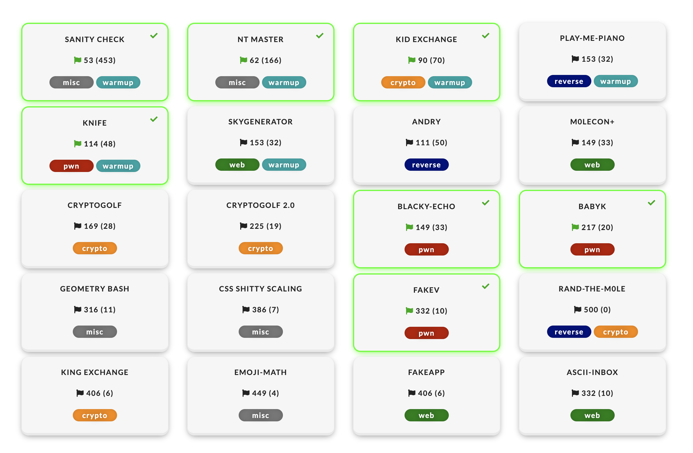

# m0lecon CTF 2020 writeups

I participated as a member of TSG. Result was 28th.

Here are my short comments for some challenges.

## babyk

This is the first kernel exploit chal which I solved during a contest.
Actually, this is somewhat an easy challenge. There exists a clear
bof, and there is almost no security mitigation like SMEP, SMAP, KPTI...
So, using typical techniques you can escalate to root.

[exploit](babyk/pwn.c)

## fakev

This chal runs on libc 2.27.
You can leak libc address. You can also create a fake FILE structure
and `fclose` it.
You can bypass vtable check by using `allocate_buffer` tricks (explaind in
[smallkirby](https://smallkirby.hatenablog.com/entry/2020/03/09/091000#4-grimoire),
[ptr-yudai](https://ptr-yudai.hatenablog.com/entry/2019/02/12/000202), [Dhaval
Kapli](https://dhavalkapil.com/blogs/FILE-Structure-Exploitation/)).

Actually my fake chunk is almost same as [smallkirby](https://smallkirby.hatenablog.com/entry/2020/03/09/091000#4-grimoire).

[exploit](fakev/exploit.py)

